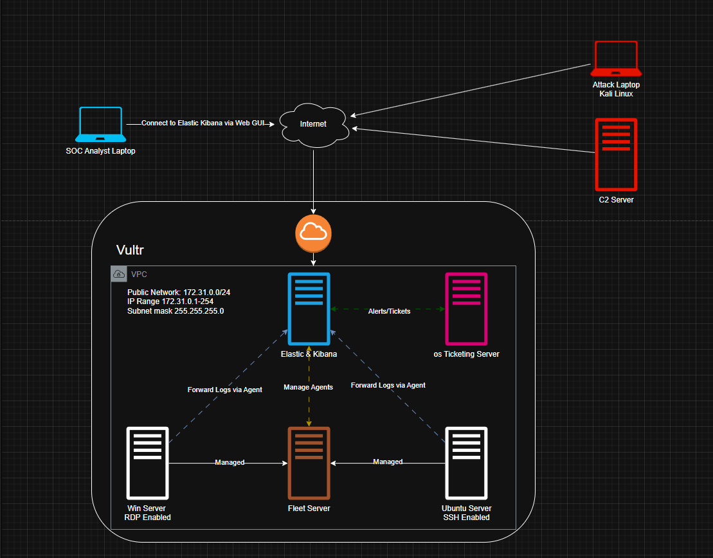

# Day 1 
Logical Diagram

I created a logical diagram for my SOC Lab network using drawio:

Nothing of note here drawio is relatively easy to use. I will be using it as a guide to flesh out the lab.
