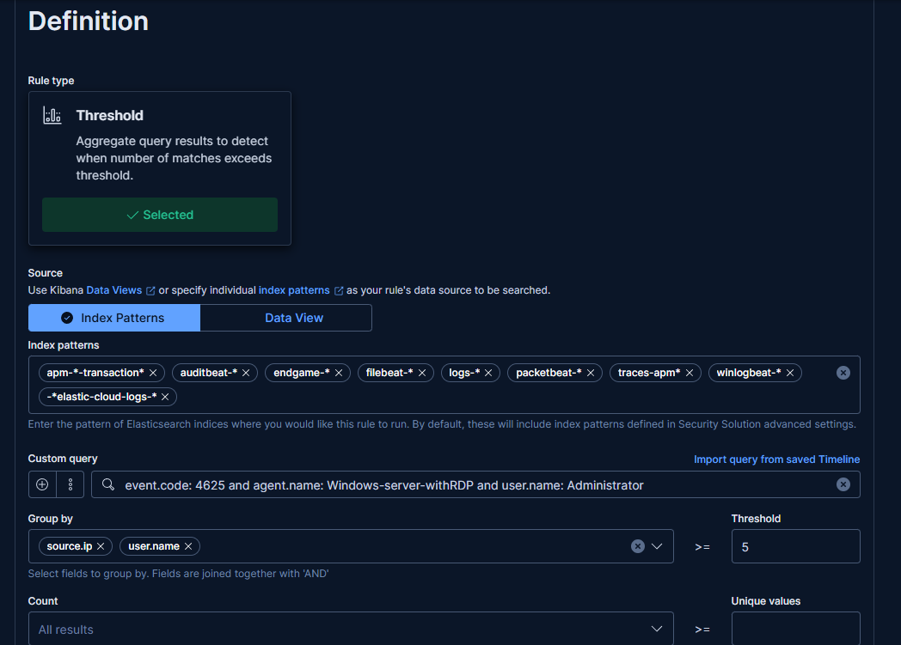
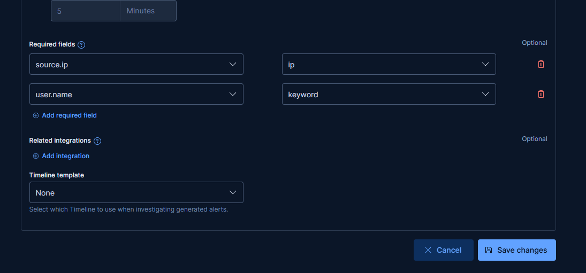
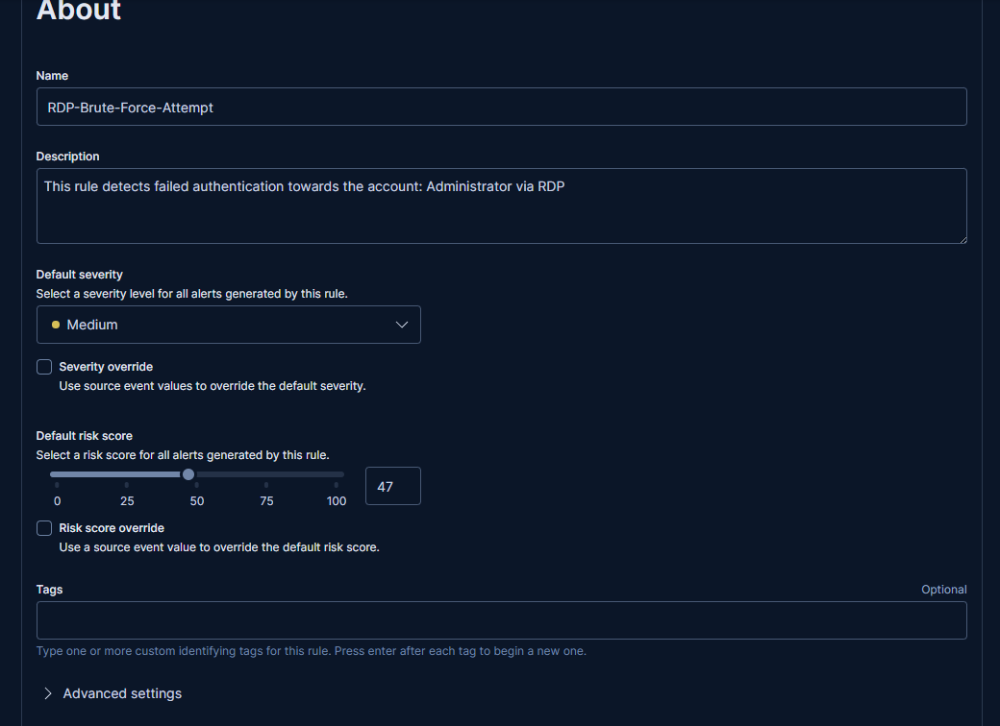
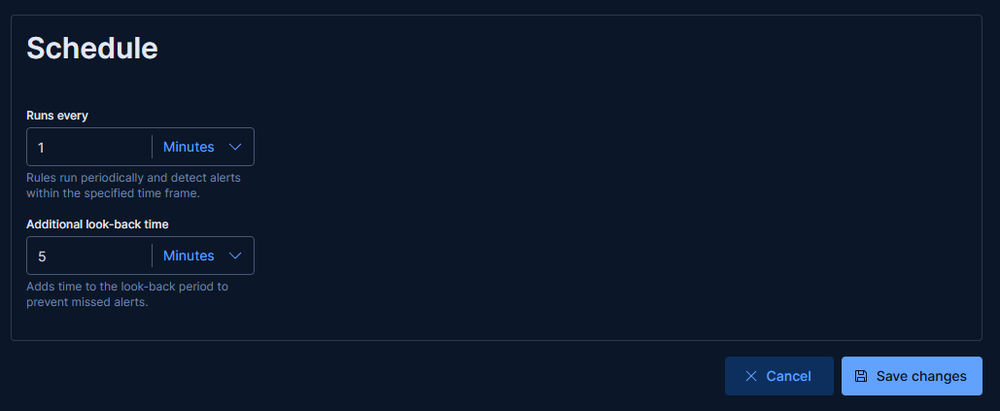
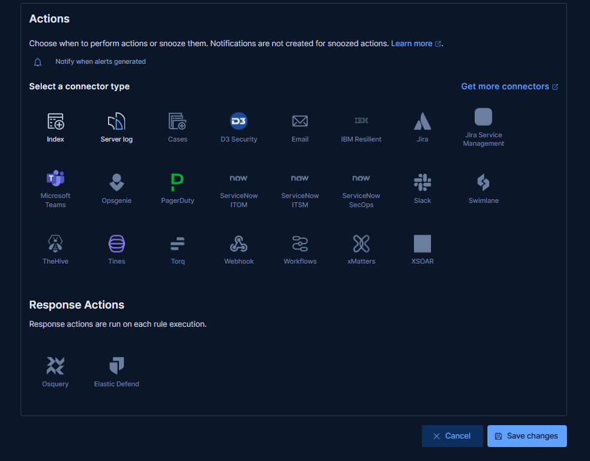
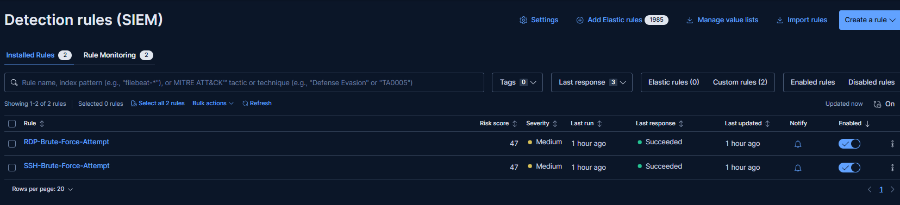
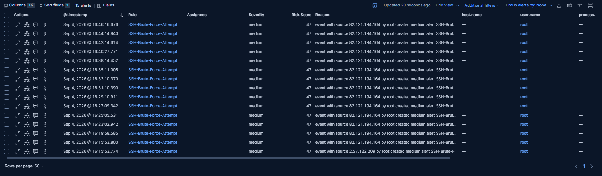
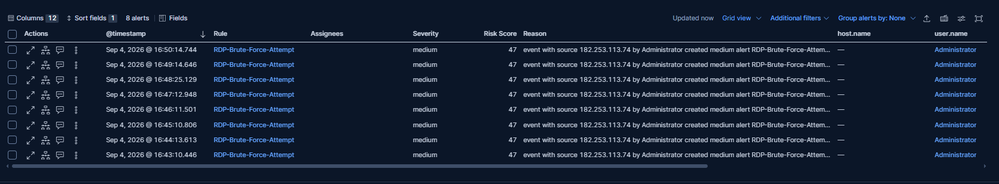

Created proper rules for alerts about failed brute forcing attempts.

For windows-server

Did the same for the ubuntu-server just with failed for the log message and username root instead of 4625 and Administrator.

Unfortunately at least for now I am unable to manually generate a brute force attack alert to test it I'll have to wait for natural alerts.

Fortunately it didn't take long at all.

For some reason the windows-server alerts took a bit of fiddling to get working but in the end I got it work.

