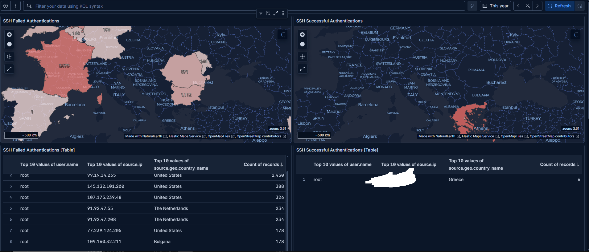
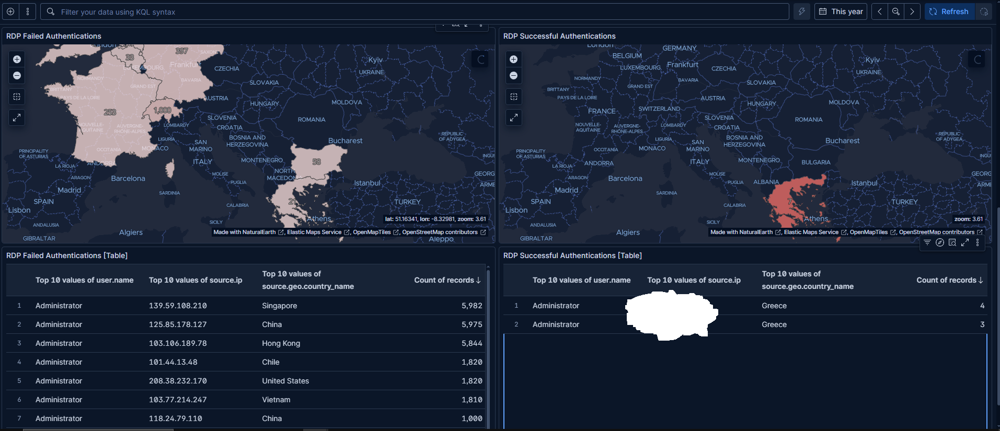
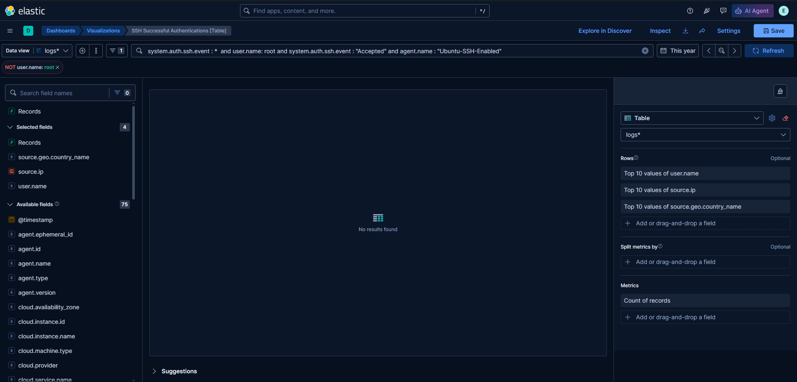
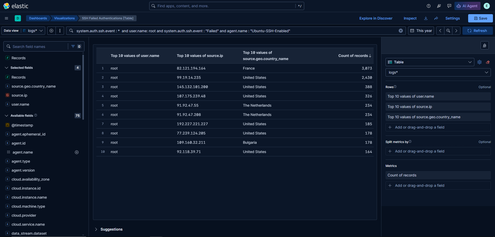
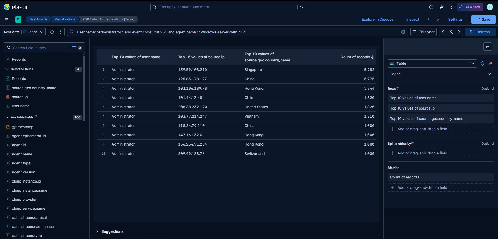
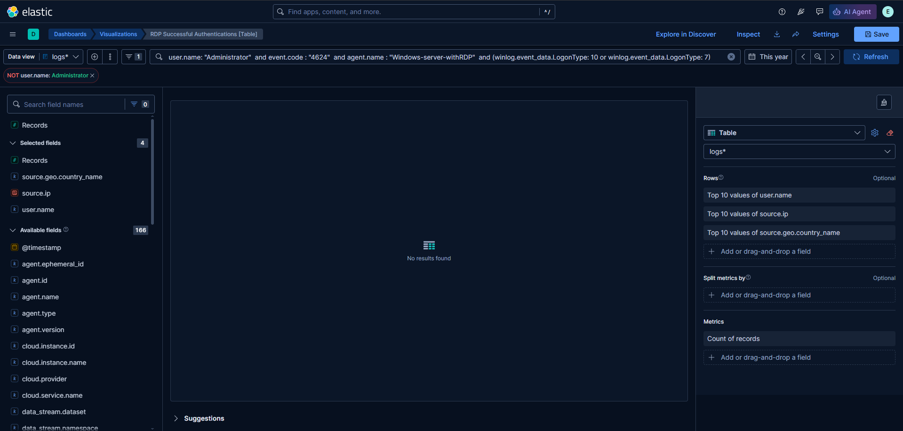
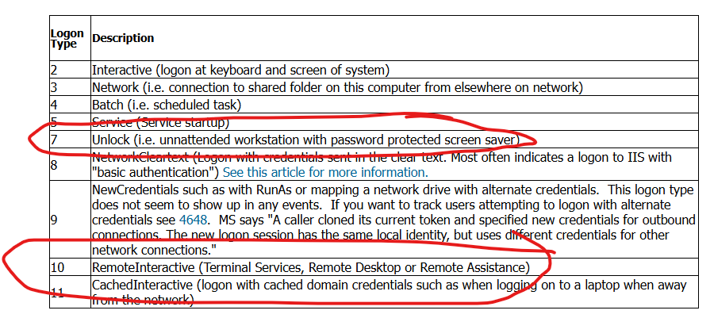

I expanded the dashboard with table variants for successful/failed authentications for both SSH and RDP respectively.

The whole dashboard doesn't fit in one screenshot. :p

On the last Dashboard for successful RDP authentications I decided to filter the types of logon instead of having every single type.
For my purposes logon 7 (workstation unlocks) and 10 (RDP sessions) are fine 

