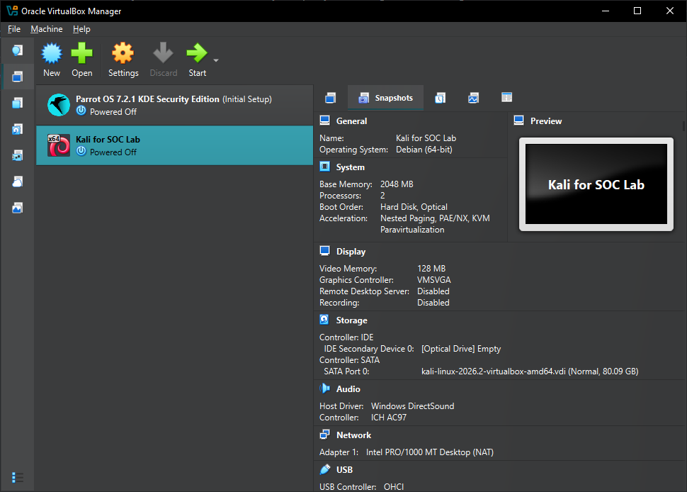
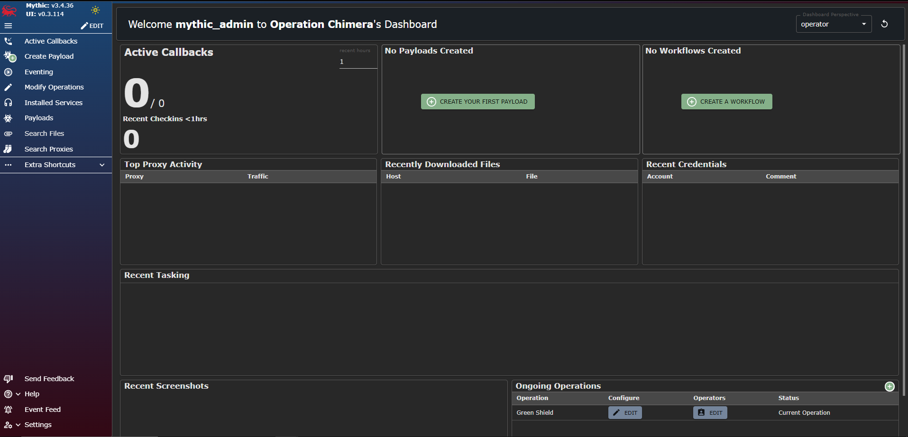

I installed kali Linux for Oracle virtual box.

I also installed Mythic on a new ubuntu instance.

Following these instructions: https://docs.mythic-c2.net/installation.

Tightened up access to the Mythic-server with a firewall that only allows TCP connection to come from my IP and the 2 lab machines I will be attacking the ubuntu-server and the windows-server that have SSH and RDP enabled.

Lastly I checked out the mythic ui through https://mythic-server-ip:7443.

