This is technically 2 days September 8th and September 9th but I decided to just include everything in one day.

I changed the windows-server password to something small and easy. I did have to change the default policy for windows to accept my new password.

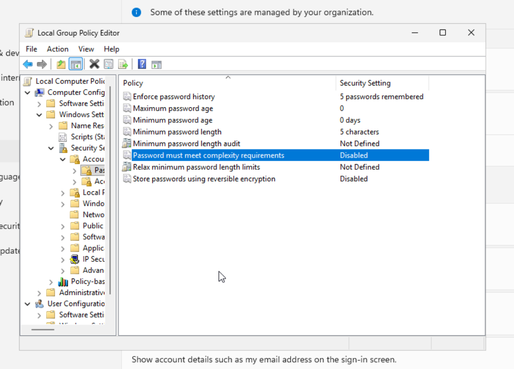

I executed then the attack diagram.

# Phase 1 Initial Access

I tried to brute force the password from the kali VM I spun up on day 13. I tried to use crowbar for the job but there was some kind of incompatibility with the current versions of xfreerdp and crowbar that caused crowbar to never find the correct password even though it was on the wordlist I gave it and it even run it through but it never worked. I tinkered with it tried to get it to work by lowering threads and even on one point trying to change the code but I decided that it wasn't worth the effort and went to hydra instead which worked well, it was slow though.

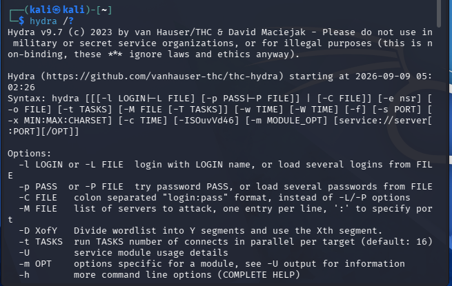

Then after 'brute forcing' the windows-server I executed the rest of the phases seen on the attack diagram

# Phase 2 Discovery

I run the discovery commands of the diagram in PowerShell.
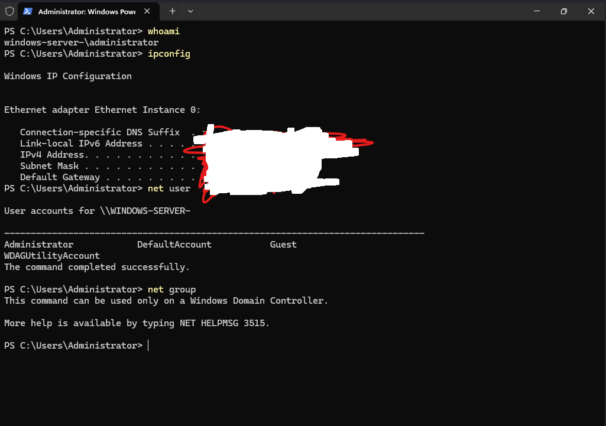

whoami = to view my privileges.

ipconfig = to view the instance's own IP and subnet mask, but also the default gateway.

net user = to see if there is other accounts on the instance, I didn't make any .

net group = to see all the groups of the local server, again none I didn't make any, but I wouldn't be able to view them anyway due to the limitation of permissions.

# Phase 3 Detection Evasion

I just turned off real time protection nothing fancy just turning switches off in the GUI.

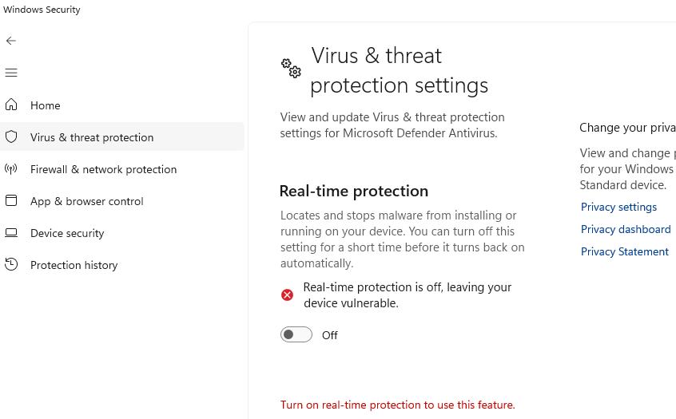

# Phase 4 Execution

I installed apollo and the http service in mythic via their githubs.

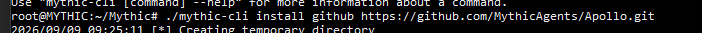
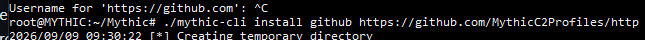

I created a payload through mythic that uses apollo as the payload and http as the c2 service.

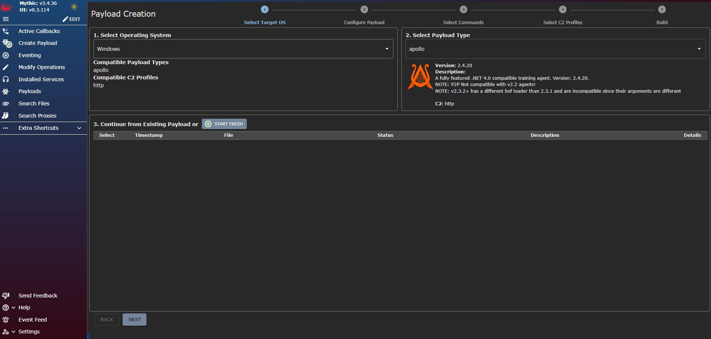
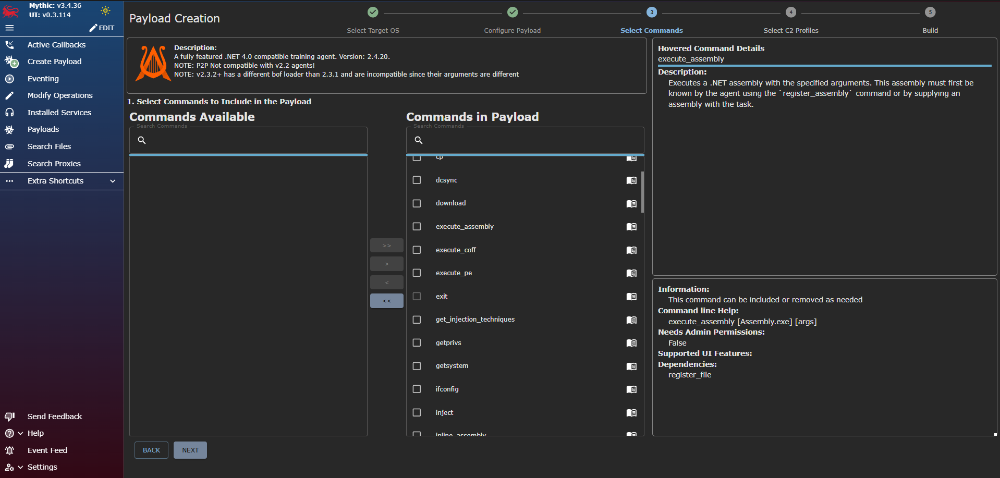
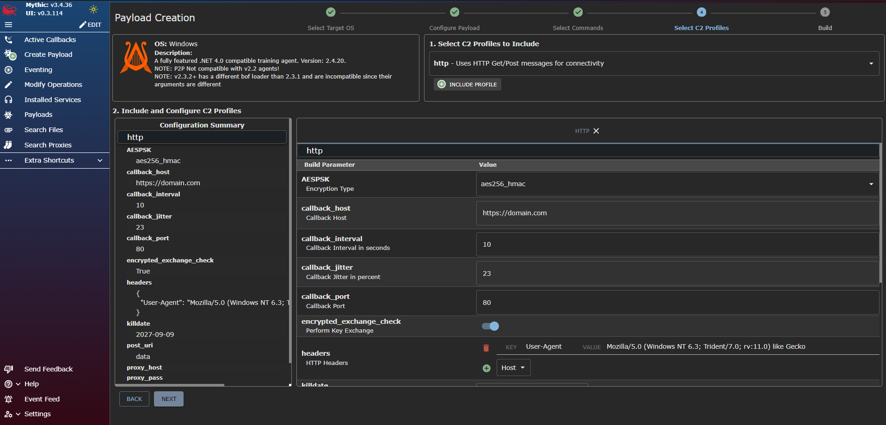

The payload is supposed to let me run commands from my mythic-server gui remotely.

I then used the mythic-server to run a http.server on port 9999 after I used ufw allow 9999 and 80 for the services to run properly.

I only realized about trying to allow port 80, when I did netstat -anob and saw that apollo.exe was trying to connect to mythic and it couldn't even(It was showing SYN-SENT) after port allow 9999 so I turned that on too and it worked.

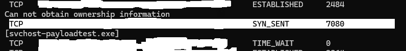
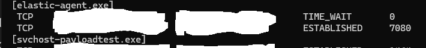
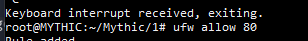
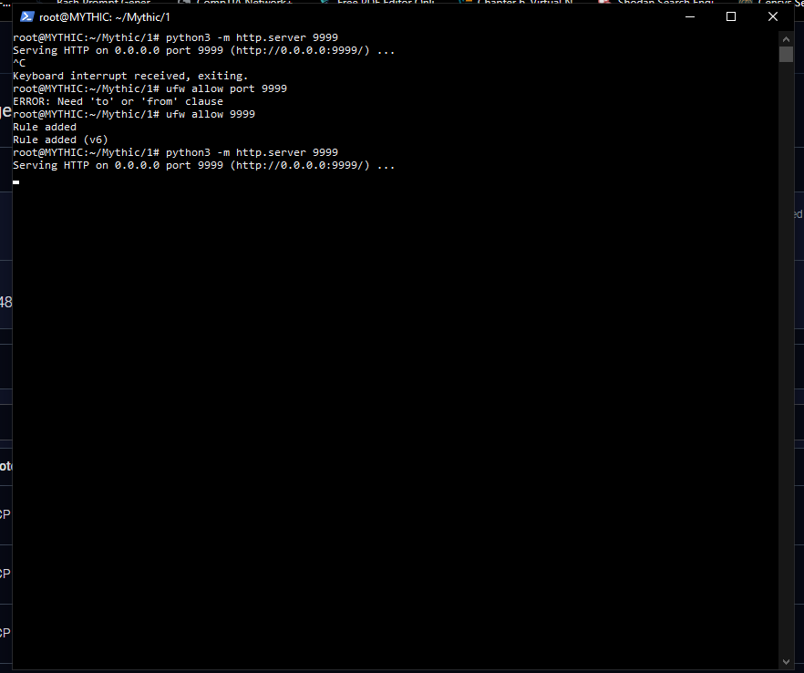
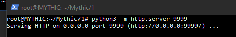

I then used a Invoke-WebRequest command on the windows-server to download the apollo payload, it was running in the task manager.

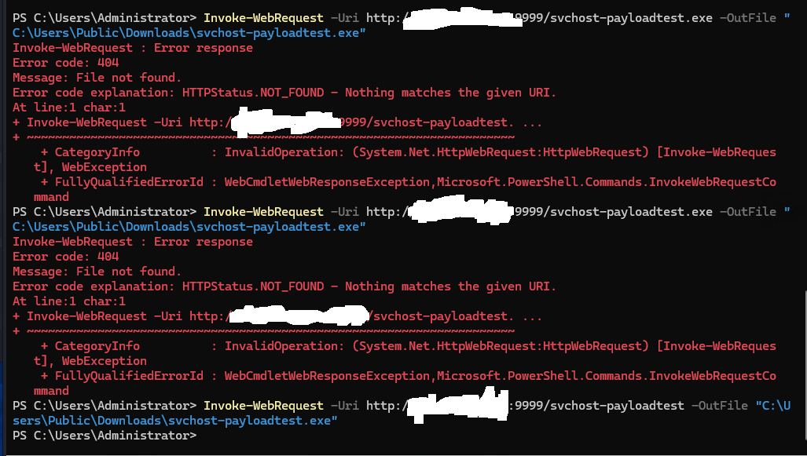
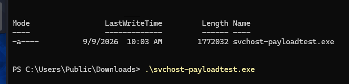
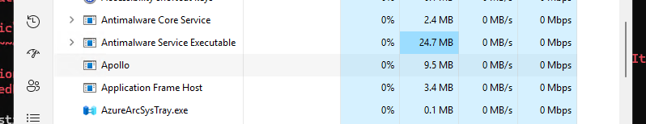

I then received a call back from the mythic-server GUI which told me that the payload is working ok.
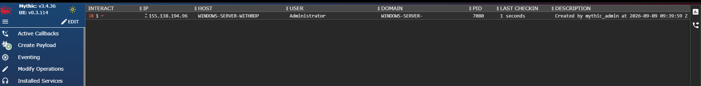

# Phase 5 Exfiltration

I just run the download command to grab the flag I set up previously(passwords.txt).

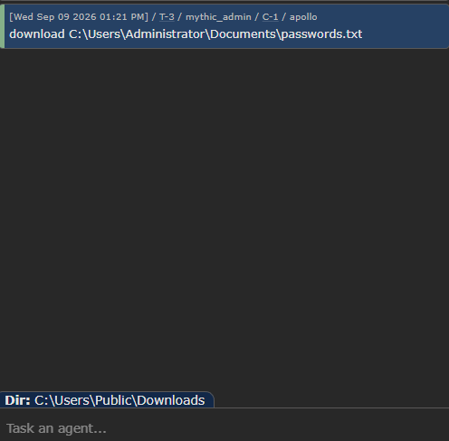
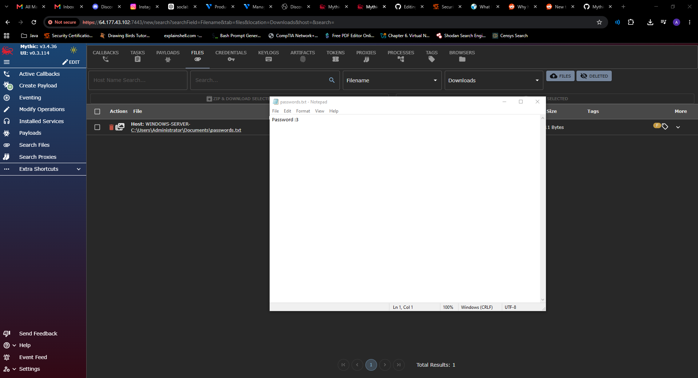

not the actual password.

