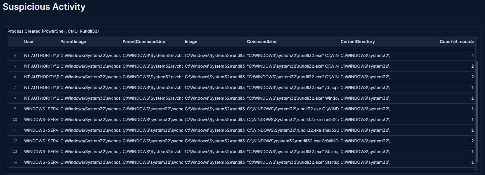
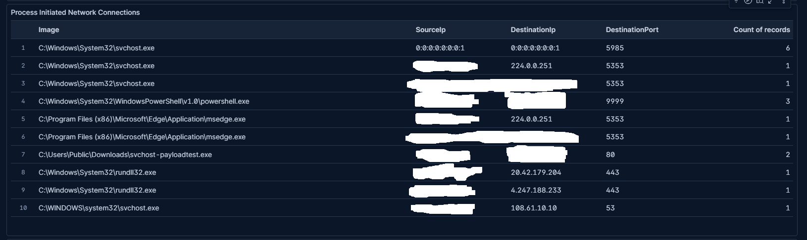
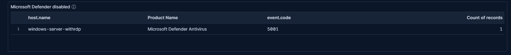

I created 3 dashboards to check on the telemetry my Apollo C2 agent that I created on day 14 generated.

The dashboards.

The query for each.

Process Created (PowerShell, CMD, Rundll32).
event.code: 1 and event.provider: "Microsoft-Windows-Sysmon" and (powershell or cmd or rundll32).

Process Initiated Network Connections.
event.code: 3 and event.provider: Microsoft-Windows-Sysmon and winlog.event_data.Initiated:"true"  and not winlog.event_data.Image : *MpDefenderCoreService.exe and not winlog.event_data.Image : *MsMpEng.exe.

Microsoft Defender disabled
event.code: 5001 and event.provider : "Microsoft-Windows-Windows Defender"
