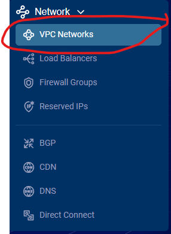
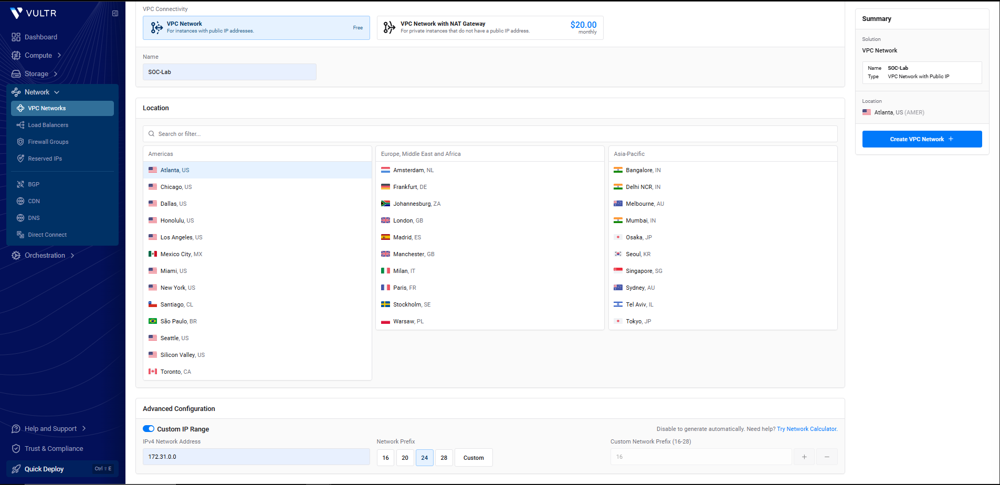
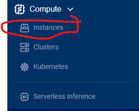
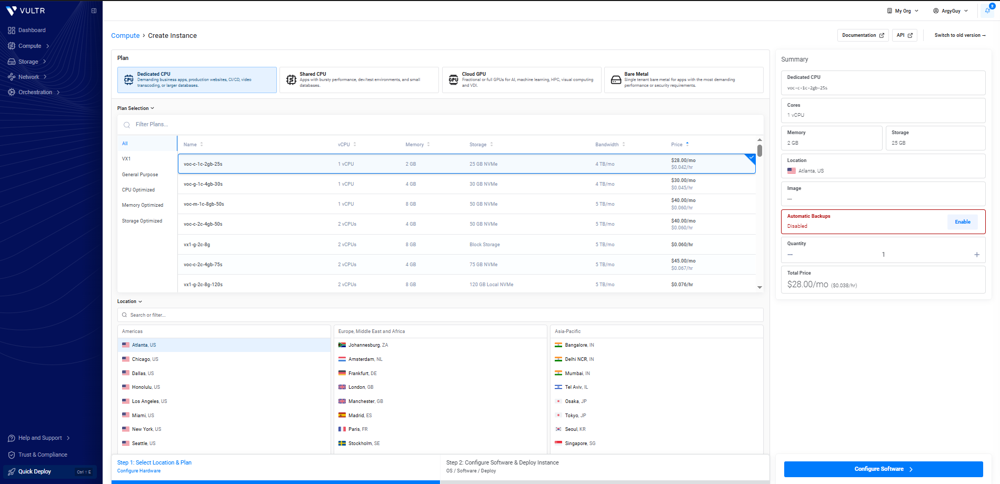
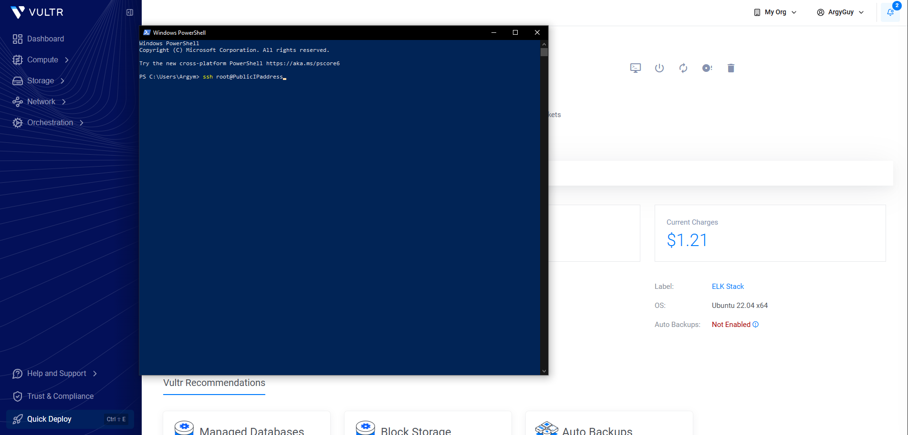

# Day 2

I configured a VPC along with one virtual ubuntu server in which I installed Elasticsearch, using Vultr as my cloud provider.

I set a custom private IP address for the VPC 172.31.0.0/24.

I created an instance (Server) inside the VPC with Ubuntu 22.04 x64 as the OS, along with very little specs like 1 vCPU, 2gb of RAM and 25GB of NVMe storage and disabled automatic backups as they aren't required for the scope of this lab.

I SSH'ed into the ubuntu instance via my computer's PowerShell with the username and password provided by the cloud provider.

I updated the server with the relevant commands apt-get update && apt-get upgrade -y, downloaded Elasticsearch deb x86_64 using wget https://artifacts.elastic.co/downloads/elasticsearch/elasticsearch-9.5.2-amd64.deb installed it using dpkg -i elasticsearch-9.5.2-amd64.deb, after install it gave me the Security autoconfiguration information prompt with the password for my elastic user which I've chosen to omit.

------------------------------------------------------------------------------------------------------------------------------------------------------------------

--------------------------- Security autoconfiguration information ------------------------------

Authentication and authorization are enabled.
TLS for the transport and HTTP layers is enabled and configured.

The generated password for the elastic built-in superuser is : Omitted 
If this node should join an existing cluster, you can reconfigure this with
'/usr/share/elasticsearch/bin/elasticsearch-reconfigure-node --enrollment-token <token-here>'
after creating an enrollment token on your existing cluster.

You can complete the following actions at any time:

Reset the password of the elastic built-in superuser with
'/usr/share/elasticsearch/bin/elasticsearch-reset-password -u elastic'.

Generate an enrollment token for Kibana instances with
 '/usr/share/elasticsearch/bin/elasticsearch-create-enrollment-token -s kibana'.

Generate an enrollment token for Elasticsearch nodes with
'/usr/share/elasticsearch/bin/elasticsearch-create-enrollment-token -s node'.

----------------------------------_--------------------------------------------------------------

 NOT starting on installation, please execute the following statements to configure elasticsearch service to start automatically using systemd
 sudo systemctl daemon-reload
 sudo systemctl enable elasticsearch.service
 
 You can start elasticsearch service by executing
 sudo systemctl start elasticsearch.service

------------------------------------------------------------------------------------------------------------------------------------------------------------------
Then I configured the Elasticsearch service with systemctl daemon-reload and enable elasticsearch.service and started it with systemctl start elasticsearch.service.
 

I then made a firewall group in which I specified that the only IP that can SSH into the server is my own.
