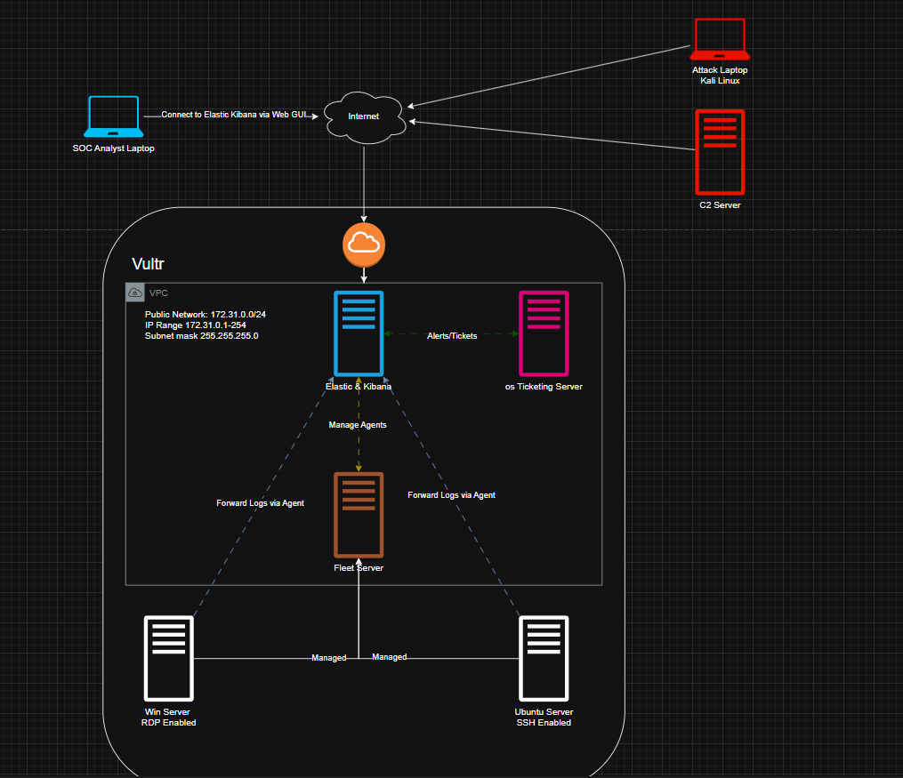

I set up a windows RDP server exposed to the internet and in lieu of that I altered the diagram to have both the ubuntu server and the windows server outside the VPC's private IP, which would help isolate any potential compromisation of those machines from infecting the rest of the network.

The new diagram.
