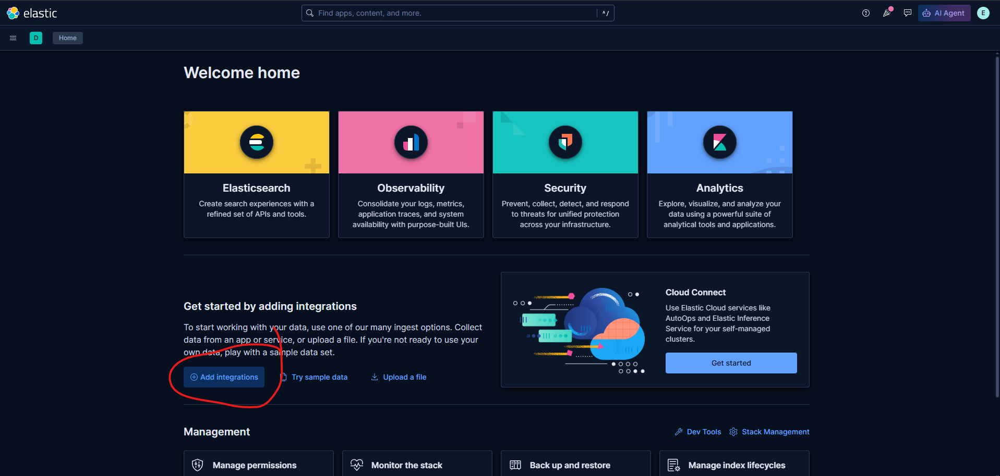
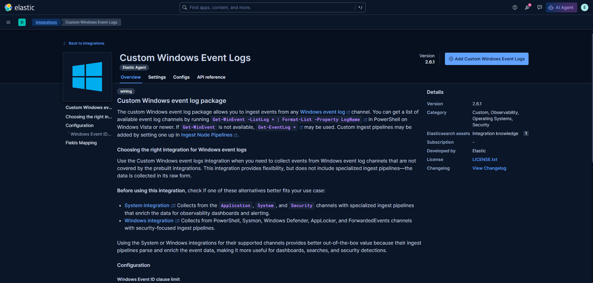
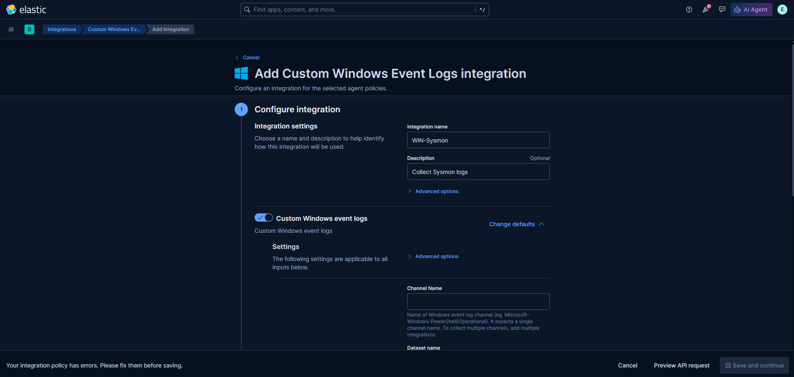
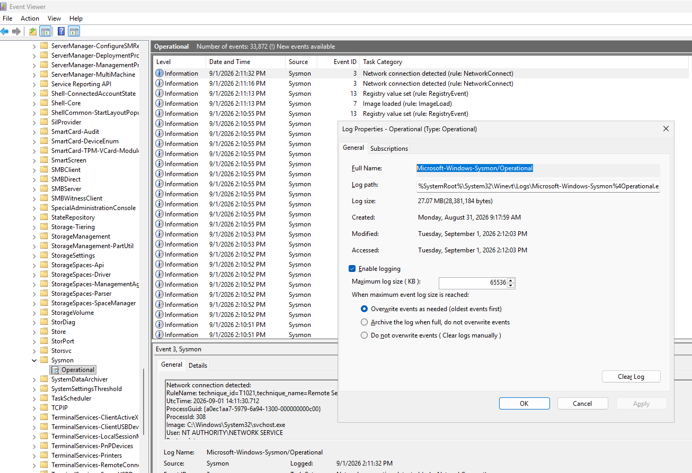
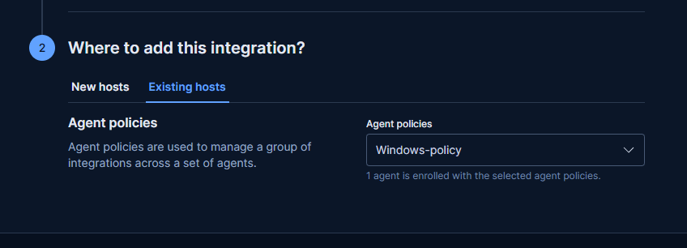
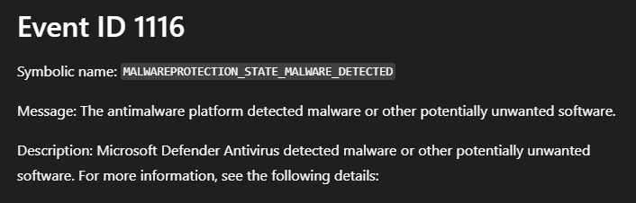
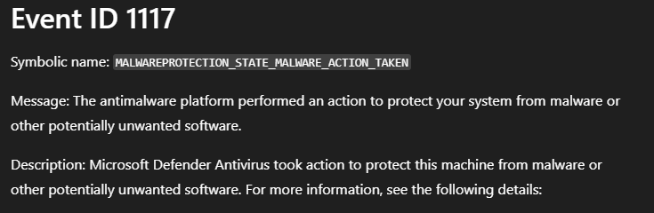
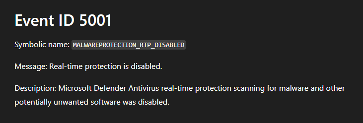
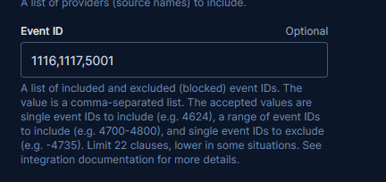
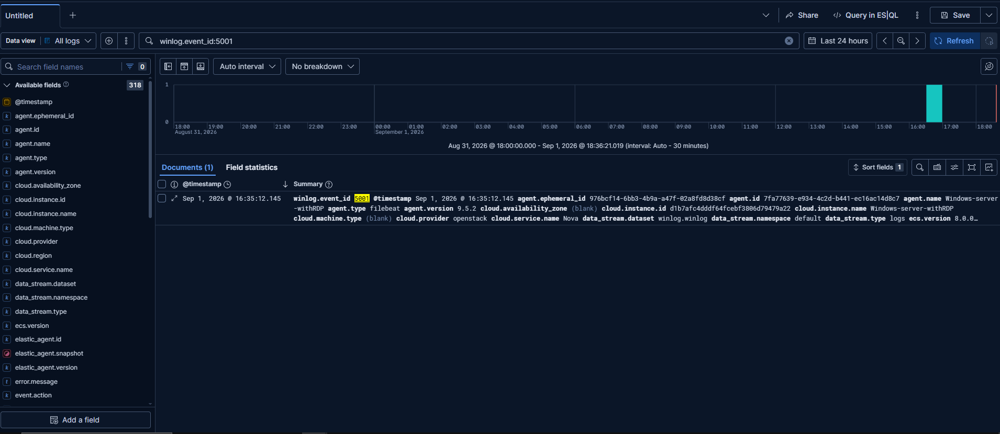

I added the custom windows event logs integration to my Elasticsearch gui.

and more specifically I added a custom windows event log for Sysmon and for windows defender of the windows-server.

I needed the channel.

I found it through the event viewer and the properties of Sysmon.

I added the integration to my windows-policy in Elasticsearch.

For windows defender integration I did pretty much the same thing but this time I specified 3 IDs that I would like to be specifically monitored so that our Elasticsearch isn't bogged down by millions of useless activity logs.

Those are the ones I considered the most important.

Here's me adding them to the windows defender integration.

I added the integration to my windows-policy in Elasticsearch.

Now I am able to view all the logs that interest me using the winlog.event_id:* term in the search bar. That's day 7. 
