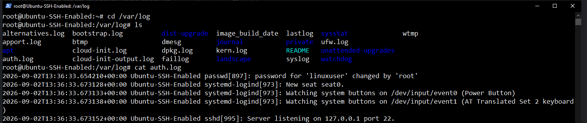

I spun up a server with Ubuntu 24.04 LTS x64 and ssh enabled to have it be a honeypot and generate brute force attack traffic. I'll be periodically checking the auth.log file for failed login attempts.

Figured the day would be a little small so I added the elastic agent to this server as well

Yeah pretty much the exact same as the windows-server setup so refer to that although the Elasticsearch gui is pretty helpful and straight forward
