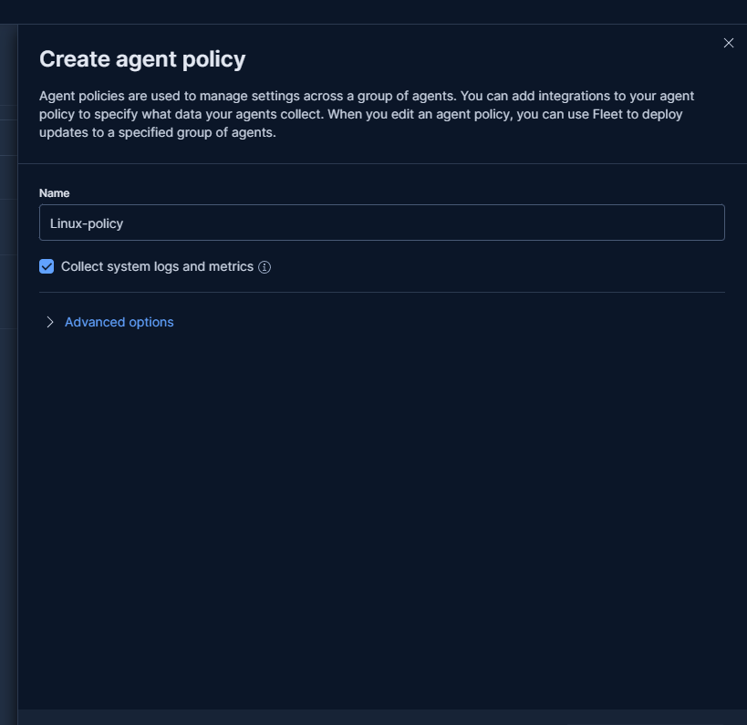
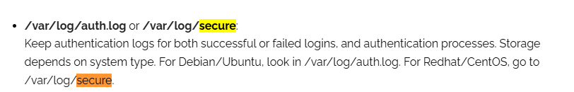
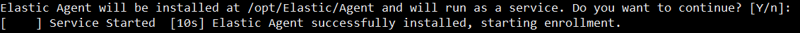
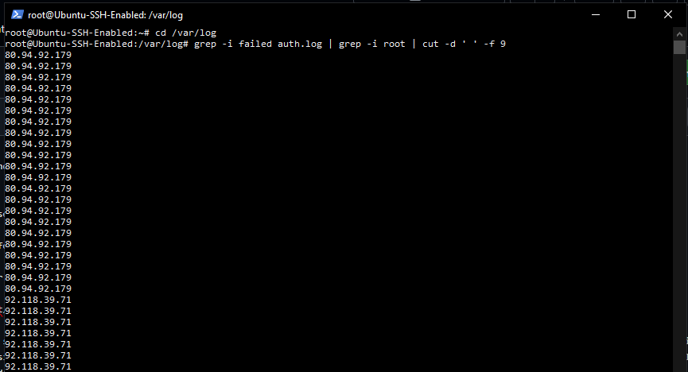
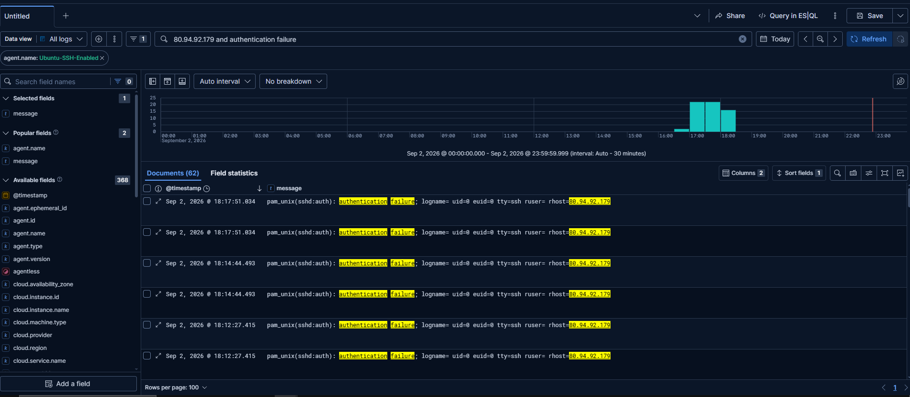

I spun up a server with Ubuntu 24.04 LTS x64 and ssh enabled to have it be a honeypot and generate brute force attack traffic. I'll be periodically checking the auth.log file for failed login attempts.

Figured the day would be a little small so I added the elastic agent to this server as well.

Yeah pretty much the exact same as the windows-server setup refer to Day5.md for reference.

Made a new policy in my fleet for linux-systems to put the ubuntu-server under.

It by default checks for both Debian/Ubuntu under /var/log/auth.log and Redhat/CentOS under /var/log/secure respectively.

Installed and enrolled the elastic agent in the ubuntu-server, I did face the same issue as in the windows-server for some reason I run the install and enroll command without --insecure at the start it complains about the certificate being signed by an unknown authority, which makes sense it's self-signed after all. However it successfully installs the elastic-agent making me believe it just isn't enrolled yet so I do the same command but only with enroll, this time it complains that it can't restart the instance. So I am forced to delete it and start fresh with --insecure already typed in. Idk.

After a few restarts of the ubuntu-server and also allowing port 9200 under the ubuntu-server IP through the ELK-stack-server firewall via Vultr, I am able to get logs of the ubuntu-server through Elasticsearch successfully.

I booted up my ssh and looked for unsuccessful logging attempts with the grep command in the auth.log file nabbed the first IP and run it through Elasticsearch and they match meaning that my Elasticsearch works correctly.

I am a little on edge about the countless brute force attempts on my machines, but even if they somehow get lucky enough to nab a machine I can just destroy the instance through Vultr and again in theory my private machine can't be accessed as I am not running any public services through it and also router firewall. 
