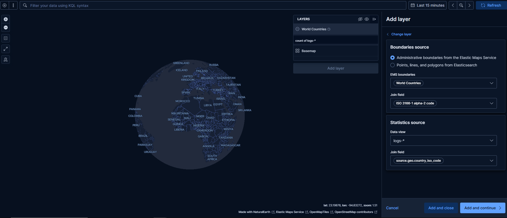
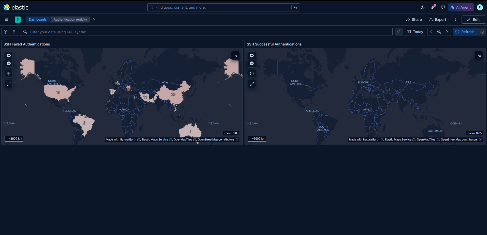
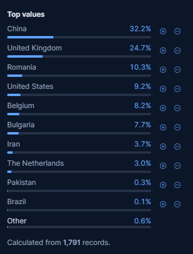

I set up a dashboard on the Elasticsearch GUI of my ELK Stack server for failed and successful authentication attempts on the ubuntu SSH enabled server

I used this filter.

Made a map layer to put that information on a map

And then I added failed and successful authentication attempts on the SSH ubuntu-server

Out of curiosity I checked to see which country has the most of these attacks and surprise surprise it's China with the UK at a close second which was actually surprising.

I wonder if there's vested interest by governments to support such activities and they just turn a blind eye, wouldn't be all that surprising.

